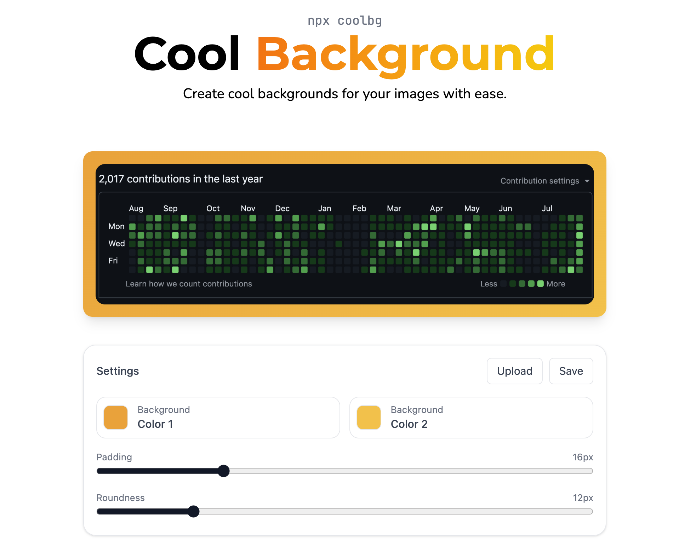

# CoolBg

**A CLI and web tool to create cool backgrounds for your images.**



Website: [coolbg.ata.soy](https://coolbg.ata.soy)

# Project Structure

```
coolbg/
├── cli/
│   ├── index.js
│   ├── package.json
│   └── utils/
│       ├── processing.js
│       ├── prompts.js
│       └── validation.js
├── web/
│   ├── src/
│   │   ├── components/
│   │   │   ├── editor/
│   │   │   ├── Hero.tsx
│   │   │   └── Footer.tsx
│   │   ├── App.tsx
│   │   └── main.tsx
│   ├── public/
│   ├── index.html
│   └── package.json
└── README.md
```

# Installation & Usage

## Settings

- Color 1: Gradient color starts top left.
- Color 2: Gradient color ends bottom right.
- Padding: Space between main image and background.
- Roundness: Edge curve of main image.

## CLI

- Simply install [coolbg npm package](https://www.npmjs.com/package/coolbg)

```bash
npx coolbg
```

## Web

- Visit : [coolbg.ata.soy](https://coolbg.ata.soy)
- Upload your image and start playing with the settings
- Download your _cool_ image
